# Superstore Sales & Profit Analysis Report (2014-2017)

## 1. Sales Overview
The monthly sales trend shows significant fluctuations between **2014 and 2018**, but a clear **upward trajectory** over time.  
Sales began modestly in 2014 and demonstrated strong growth toward the end of 2017, peaking around late 2017.  
This suggests overall business expansion and possibly improved **marketing or customer acquisition** strategies.    

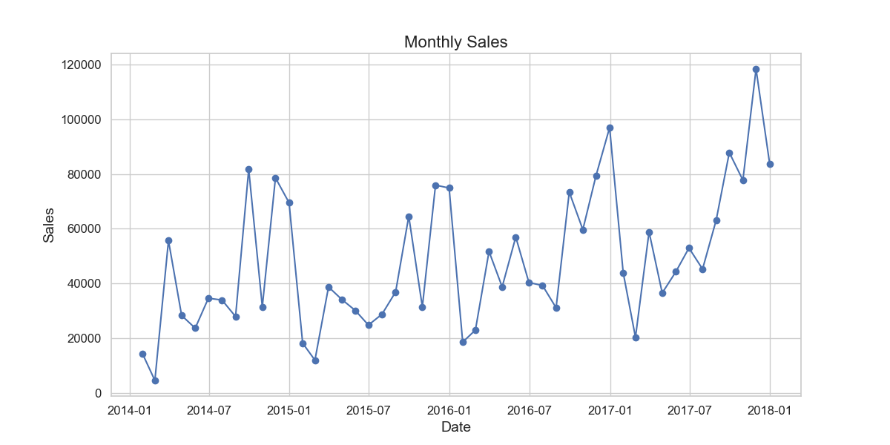
---

## 2. Sales by Category
Sales distribution across product categories reveals that **Technology** leads in total sales, followed by **Furniture** and **Office Supplies**.  
The strong performance of Technology products highlights their importance as the company’s main **revenue driver**.  
This could be due to higher unit prices or increased consumer demand for tech-related products.

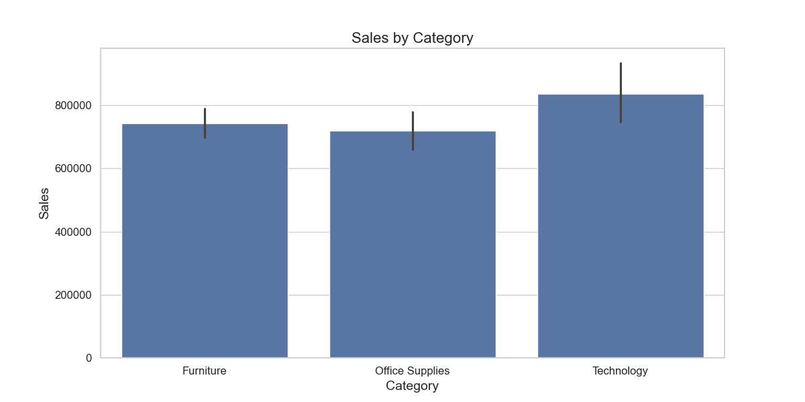
---

## 3. Sales by Sub-Category
At the sub-category level:
- **Phones** and **Chairs** are the top-selling products.  
- **Fasteners**, **Labels**, and **Envelopes** contribute minimally.

This indicates a strong dependency on a few high-performing items, suggesting potential for **diversification** or **marketing focus** on underperforming sub-categories.

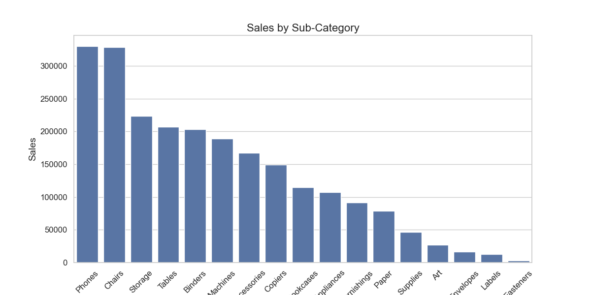
---

## 4. Profitability by Category
Profit distribution shows that:
- **Technology** again dominates with the highest profit margin.  
- **Office Supplies** performs well despite lower sales.  
- **Furniture**, despite high sales, shows **very low profit contribution**.

This implies potential **pricing** or **cost management issues** within the Furniture category that require deeper investigation.    

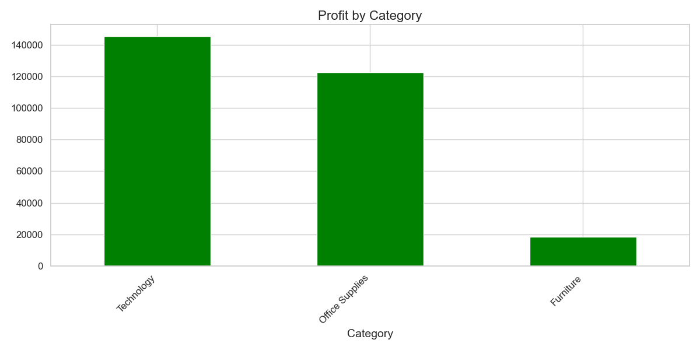
---

## 5. Profit by Region
Regional profitability breakdown:
- **West:** ~38%  
- **East:** ~32%  
- **South:** ~16%  
- **Central:** ~14%

The **Central region’s low profitability** could indicate logistical inefficiencies, pricing misalignment, or stronger competition.  

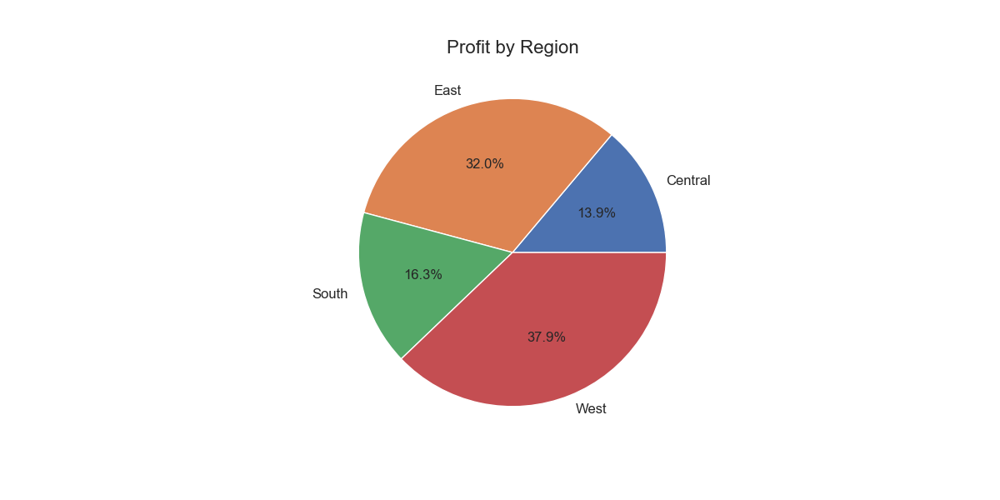
---

## 6. Correlation Insights
The **correlation matrix** indicates:
- **Sales vs. Profit:** moderate positive correlation (**0.48**)  
- **Quantity vs. Profit:** weak correlation (**0.066**)

This suggests that **higher sales generally lead to higher profit**, but **increased quantity sold** doesn’t necessarily mean higher profitability — possibly due to discounts or product mix effects.    

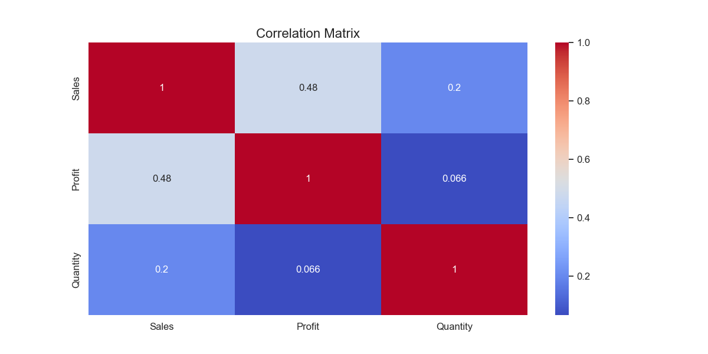
---

## 7. Discounts and Profitability
The relationship between **discount levels** and **average profit** is **strongly negative**.  
As discounts increase, profits drop sharply — especially beyond a **0.3–0.5 discount level**, where profits turn **negative**.

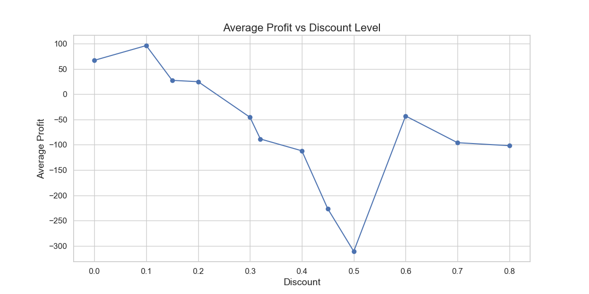      

**Conclusion**: Tighter discount policies are needed to prevent margin erosion.

---

## 8. Sales by Day of the Week
Sales are highest on:
- **Monday** and **Friday**

And lowest on:
- **Wednesday**

This pattern suggests optimizing **promotional timing** and **staffing** to capitalize on high-traffic days.
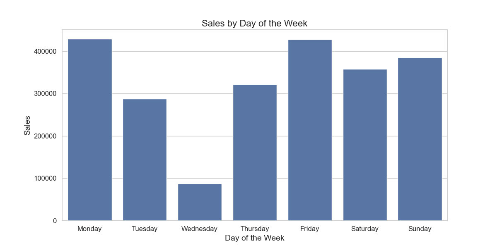

---

## 9. Shipping Mode Analysis
Sales distribution by shipping mode:
- **Standard Class:** highest sales and profit  
- **Second Class** and **First Class:** moderate performance  
- **Same Day:** lowest sales (but premium offering)

Standard Class shipping offers the **best sales-profit balance**, indicating strong **logistics efficiency**.      

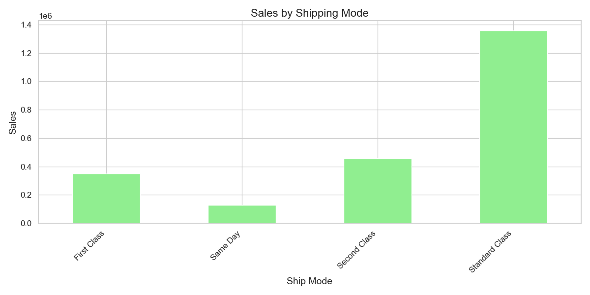      
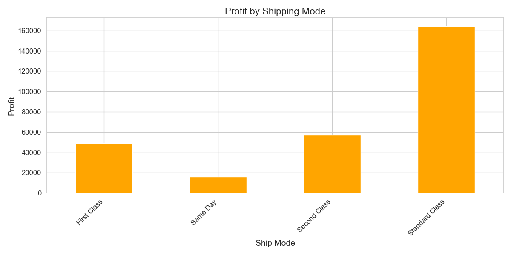
---

## 10. Top Customers by Profit
Profit distribution among top-performing customers:
- **Tamara Chand**, **Raymond Buch**, and **Sanjit Chand** are the most profitable clients  
- A small group of customers drives a **disproportionate share of total profit** -> the top 10 customers generate 15.62% of total profit. 
- Indicates strong **customer loyalty** and **repeat purchasing behavior** among high-value clients  
- Recommendation: Implement **loyalty or premium programs** to strengthen relationships and increase retention
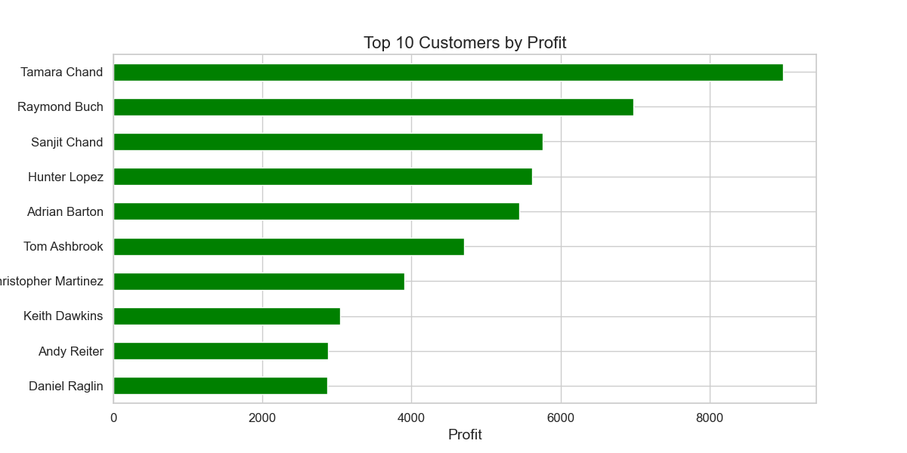

---

## 11. Products with Lowest Sales (Value)
Products with the lowest total sales value:
- Items such as **Eureka Disposable Bags** and **Avery 5** show minimal contribution to total revenue  
- Most are **low-margin office supplies** — pens, envelopes, and paper products  
- These products add **operational cost** without significantly increasing profit  
- Recommendation: Consider **bundling** or **discontinuing** low-performing items to optimize product portfolio      
.png)

---

## 12. Products with Lowest Sales (Quantity)
Products with the lowest number of units sold:
- Items like **Boston 1900 Electric Pencil Sharpener** and **Bush Saratoga Bookcase** have very low sales volumes  
- Many are **niche or high-value** products — low quantity does not always mean poor performance  
- These may have **limited demand but high margin per item**  
- Recommendation: Evaluate **profit per unit** and keep only high-margin low-volume products      
.png)

---

## 13. 🧭 Key Takeaways      
- **Technology** and **Office Supplies** generate the highest profit and sales.  
- **Standard Class** shipping offers the best sales–profit balance.  
- A few **key customers** drive most of the profit — retention is crucial.  
- Several **low-selling products** could be discontinued or optimized.  
- Focus on **high-margin items** and efficient **logistics operations** for growth.

